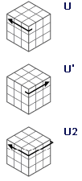
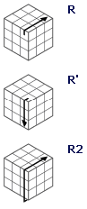
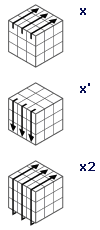
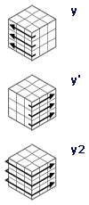
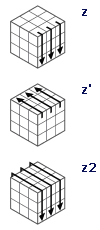
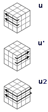
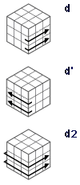
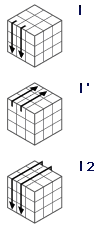
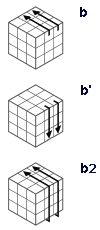
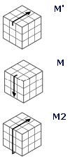

### Basic Rubik's cube terms

The Rubik's Cube has 6 faces:  Up Down Front Back Left Right, we use the first letter of English to express, as shown below:

<table class="hoverable bordered striped responsive-table">
    <tbody>
        <tr>
            <td>U(Up)</td>
            <td>D(Down)</td>
        </tr>
        <tr>
            <td>F(Face)</td>
            <td>B(Back)</td>
        </tr>
        <tr>
            <td>L(Left)</td>
            <td>R(Right)</td>
        </tr>
    </tbody>
</table>

#### Rubik's rule of rotation
The rotation of the cube is in units of faces, for example:
U means that the top surface is rotated 90 degrees clockwise. It is easy to understand that U**'** means to rotate 90 degrees counterclockwise, U2 means to rotate the top surface 180 degrees, that is, 2 U, and so on.
Assuming that the Rubik's Cube is rotated with the right hand, U means that the top layer is turning forward, and U**'** means that the top layer is reversed. The following figure shows the common Rubik's cube rotation. These basic symbols need to be kept in mind, because they will be the components in the following formula. section.

<table>
    <tbody>
        <tr>
            <td></td>
            <td></td>
            <td></td>
        </tr>
        <tr>
            <td></td>
            <td></td>
            <td></td>
        </tr>
    </tbody>
</table>

#### These are symbols that are not commonly used in basic learning. It is not too late to remember when you play high-level needs.
<table>
    <tbody>
        <tr>
            <td></td>
            <td></td>
            <td></td>
        </tr>
        <tr>
            <td></td>
            <td></td>
            <td></td>
        </tr>
        <tr>
            <td></td>
            <td></td>
            <td></td>
        </tr>
        <tr>
            <td></td>
            <td></td>
            <td></td>
        </tr>
    </tbody>
</table>
