### Know the elements of the Rubik's Cube
There are 3 kinds of blocks in the Rubik's Cube. The corner blocks the edge block and the center block. Each of the following pictures has an eye mark. This mark indicates the front(F) face of the cube.

#### Corner block
Each corner block has 3 colors, a total of 8 corner blocks.
<table>
  <tr>
      <td>UFL(1)</td>
      <td>UBL(2)</td>
      <td>UBR(3)</td>
      <td>UFR(4)</td>
  </tr>
  <tr>
      <td>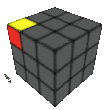</td>
      <td>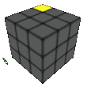</td>
      <td>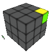</td>
      <td>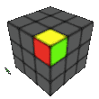</td>
  </tr>

  <tr>
      <td>DFL(5)</td>
      <td>DBL(6)</td>
      <td>DBR(7)</td>
      <td>DFR(8)</td>
  </tr>
  <tr>
      <td>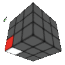</td>
      <td>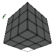</td>
      <td>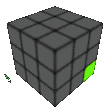</td>
      <td>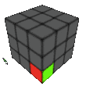</td>
  </tr>
</table>

#### Edge block
Each edge block has 2 colors, total of 12 edge blocks
<table>
  <tr>
      <td>UF(1)</td>
      <td>UL(2)</td>
      <td>UB(3)</td>
      <td>UR(4)</td>
  </tr>
  <tr>
      <td>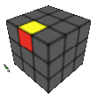</td>
      <td>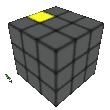</td>
      <td>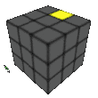</td>
      <td>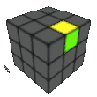</td>
  </tr>

  <tr>
      <td>DF(5)</td>
      <td>DL(6)</td>
      <td>DB(7)</td>
      <td>DR(8)</td>
  </tr>
  <tr>
      <td>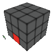</td>
      <td>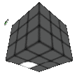</td>
      <td>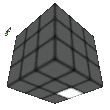</td>
      <td>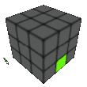</td>
  </tr>

  <tr>
      <td>FR(9)</td>
      <td>FL(0)</td>
      <td>BL(A)</td>
      <td>BR(B)</td>
  </tr>
  <tr>
      <td>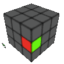</td>
      <td>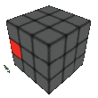</td>
      <td>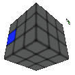</td>
      <td>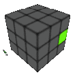</td>
  </tr>
</table>

#### Center block
Each face has a center block
<table>
<tr>
    <td>U(1)</td>
    <td>D(2)</td>
    <td>F(3)</td>
  </tr>
  <tr>
    <td>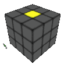</td>
    <td>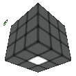</td>
    <td>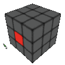</td>
  </tr>

  <tr>
    <td>B(4)</td>
    <td>L(5)</td>
    <td>R(6)</td>
  </tr>
  <tr>
    <td>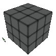</td>
    <td>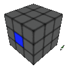</td>
    <td>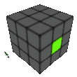</td>
  </tr>
</table>
