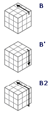

### 魔方术语

魔方共有6个面:顶底前后左右,我们用英语的首字母来表示,如下图：
<table class="hoverable bordered striped responsive-table">
    <tbody>
        <tr>
            <td>U(Up)</td>
            <td>D(Down)</td>
        </tr>
        <tr>
            <td>F(Face)</td>
            <td>B(Back)</td>
        </tr>
        <tr>
            <td>L(Left)</td>
            <td>R(Right)</td>
        </tr>
    </tbody>
</table>

##### 魔方的转动规则
魔方的转动以面为单位,举例来说:
U 表示顶面按顺时针转动90度，容易理解U'表示按逆时针方向转动90度,U2 表示顶面转动180度,也就是2个U,其他面以此类推.
假定是用右手在转动魔方,那么U就表示顶层正转,U'表示顶层反转.下图列出了常用的魔方转动方式,这些基础的符号需要牢记,因为他们将是后面公式中的组成部分.
<table>
    <tbody>
        <tr>
            <td></td>
            <td></td>
            <td></td>
        </tr>
        <tr>
            <td></td>
            <td></td>
            <td></td>
        </tr>
    </tbody>
</table>

##### 这些是基础学习中不常用到的符号,等你玩到高阶需求时再来记忆也不迟.
<table>
    <tbody>
        <tr>
            <td></td>
            <td></td>
            <td></td>
        </tr>
        <tr>
            <td></td>
            <td></td>
            <td></td>
        </tr>
        <tr>
            <td></td>
            <td></td>
            <td></td>
        </tr>
        <tr>
            <td></td>
            <td></td>
            <td></td>
        </tr>
    </tbody>
</table>
